# 🔄 Fluxograma: Sistema de Curadoria de Notícias e RabbitMQ

## 📋 Visão Geral do Sistema

O sistema de curadoria de notícias utiliza uma arquitetura baseada em mensageria assíncrona com RabbitMQ para processar a geração, curadoria e distribuição de notícias de forma escalável e desacoplada.

---

## 🏗️ Arquitetura Geral

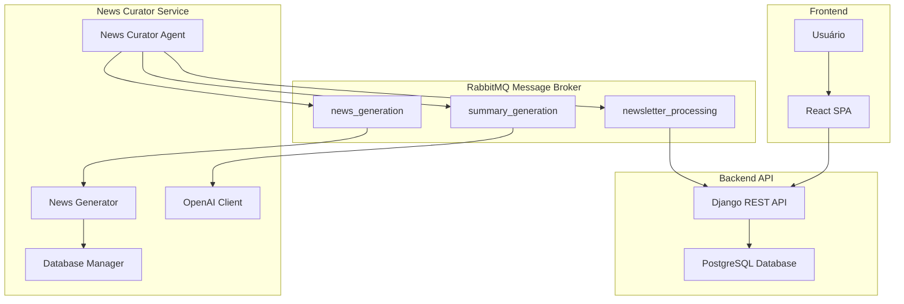

---

## 🔄 Fluxo Principal de Curadoria

### 1. **Inicialização do Sistema**

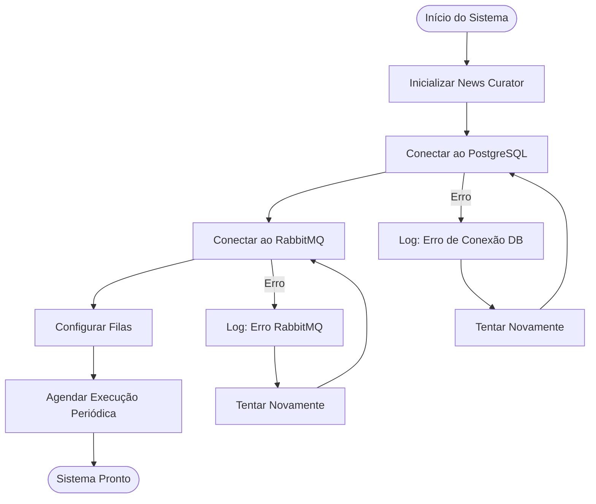

### 2. **Ciclo de Geração de Notícias**

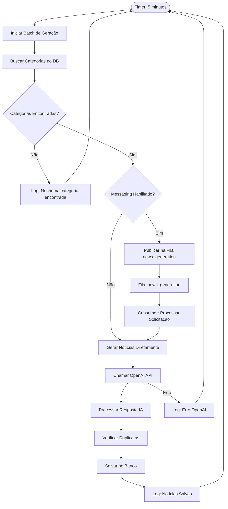

---

## 📨 Sistema de Mensageria RabbitMQ

### **Configuração das Filas**

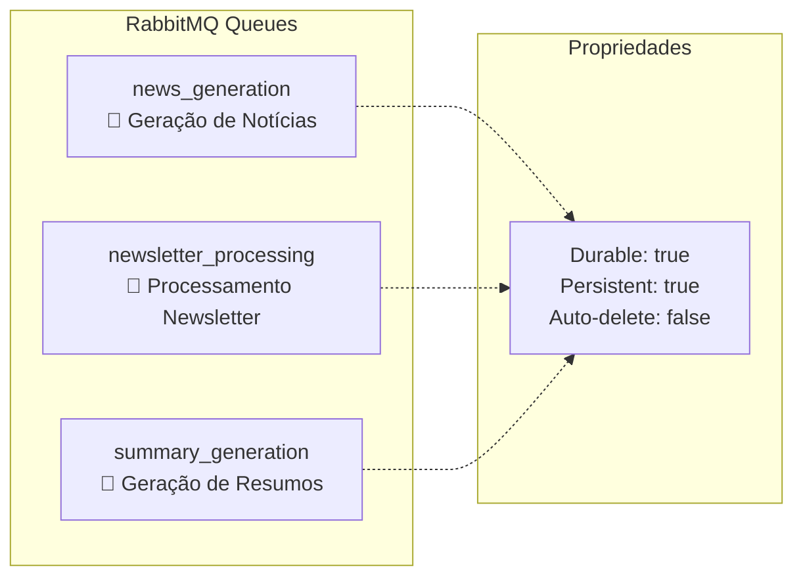

### **Fluxo de Mensagens**

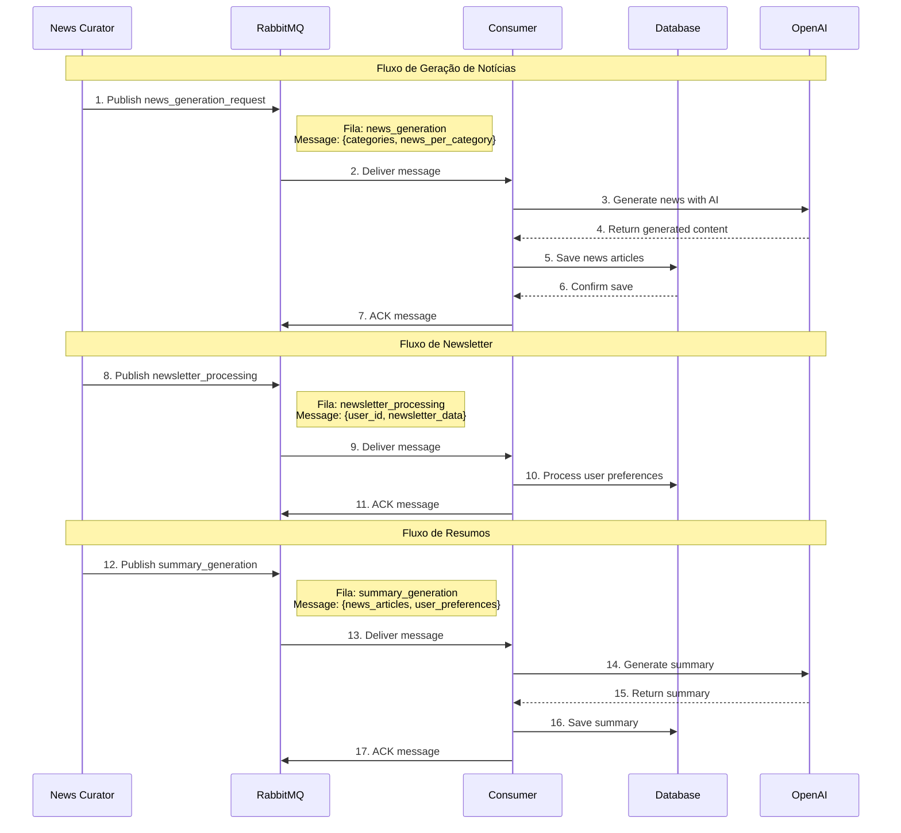

---

## 🔧 Detalhamento dos Componentes

### **1. News Curator Agent**

```mermaid
flowchart LR
    subgraph "News Curator"
        SCHEDULER[Scheduler<br/>⏰ schedule.every(5).minutes]
        GENERATOR[News Generator<br/>🤖 OpenAI Integration]
        DB_MGR[Database Manager<br/>🗄️ PostgreSQL Connection]
        MSG_MGR[Message Manager<br/>📨 RabbitMQ Integration]
    end
    
    SCHEDULER --> GENERATOR
    GENERATOR --> DB_MGR
    GENERATOR --> MSG_MGR
    MSG_MGR --> SCHEDULER
```

### **2. Message Handler**

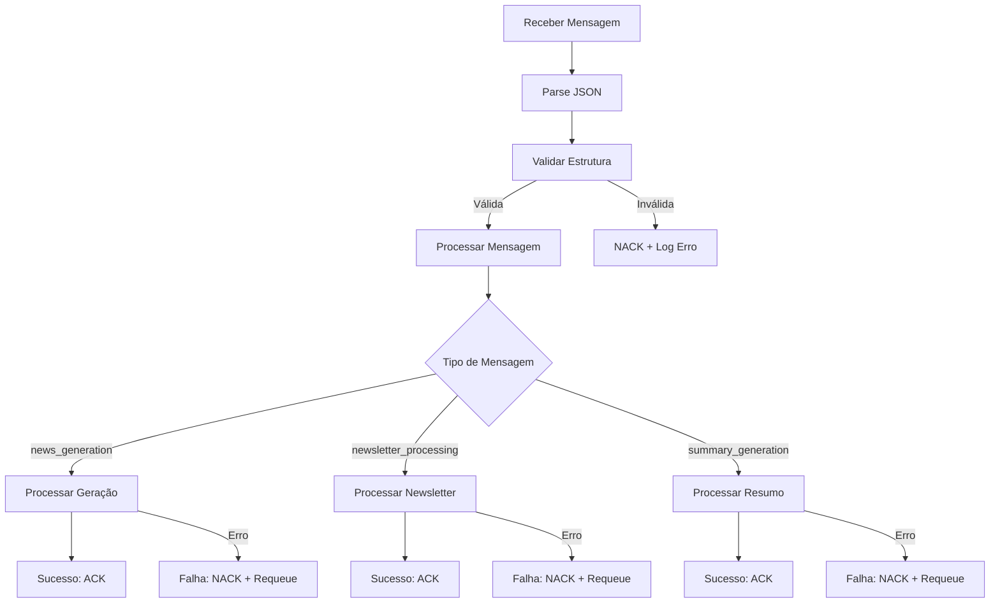

### **3. Geração de Notícias com IA**

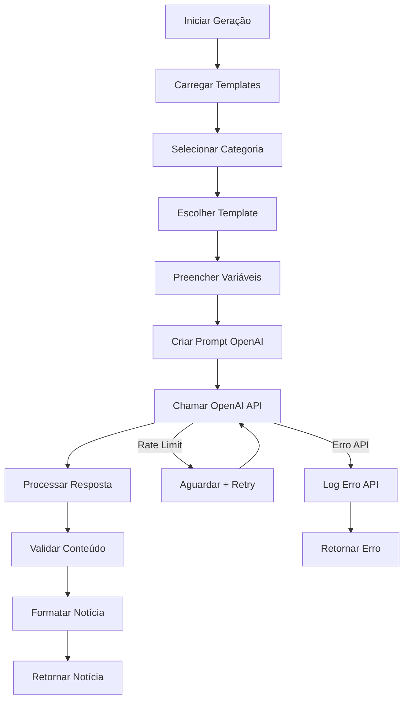

---

## ⚙️ Configurações e Parâmetros

### **Configuração do Curator**

```yaml
CURATOR_CONFIG:
  generation_interval: 300  # 5 minutos
  news_per_batch: 3        # Notícias por lote
  max_retries: 3           # Tentativas máximas
  retry_delay: 60          # Delay entre tentativas (segundos)
```

### **Configuração RabbitMQ**

```yaml
RABBITMQ_CONFIG:
  host: rabbitmq
  port: 5672
  username: admin
  password: admin123
  enable_messaging: true
  
QUEUES:
  - name: news_generation
    durable: true
    auto_delete: false
  - name: newsletter_processing  
    durable: true
    auto_delete: false
  - name: summary_generation
    durable: true
    auto_delete: false
```

### **Configuração OpenAI**

```yaml
OPENAI_CONFIG:
  model: gpt-3.5-turbo
  max_tokens: 1000
  temperature: 0.7
  timeout: 30
```

---

## 🔄 Estados e Tratamento de Erros

### **Estados das Mensagens**

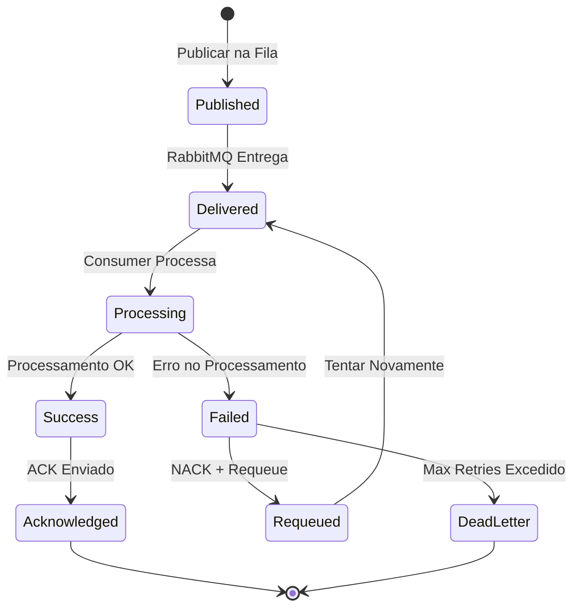

### **Tratamento de Erros**

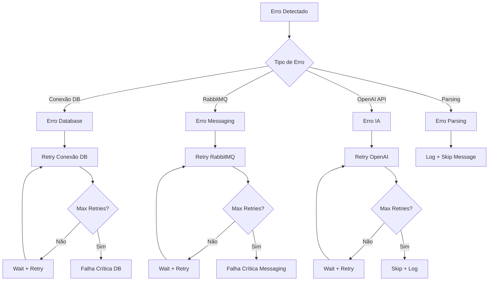

---

## 📊 Monitoramento e Logs

### **Logs do Sistema**

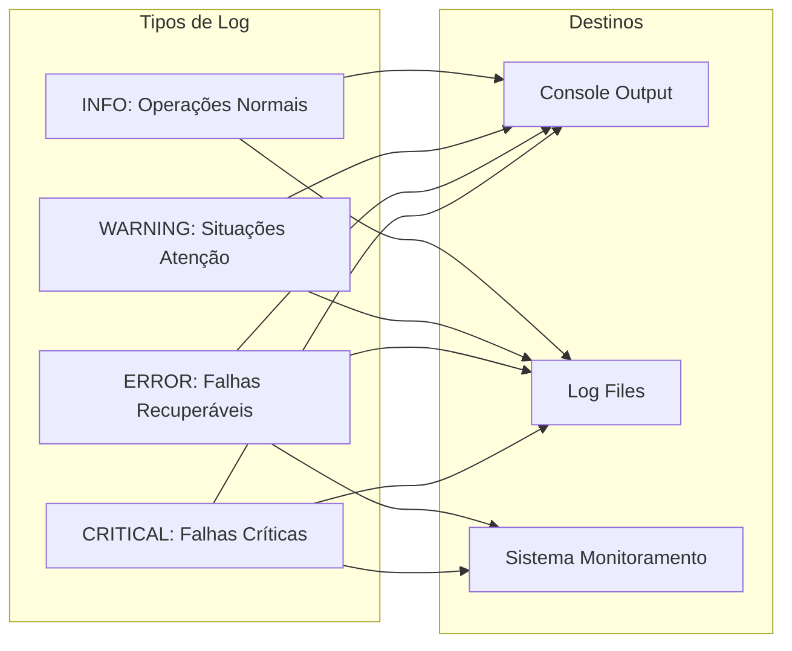

### **Métricas Importantes**

- **Taxa de Geração**: Notícias geradas por minuto
- **Taxa de Sucesso**: % de mensagens processadas com sucesso
- **Latência**: Tempo médio de processamento
- **Tamanho das Filas**: Número de mensagens pendentes
- **Uso de API**: Calls para OpenAI por período
- **Erros**: Contagem de erros por tipo

---

## 🚀 Escalabilidade e Performance

### **Estratégias de Escalabilidade**

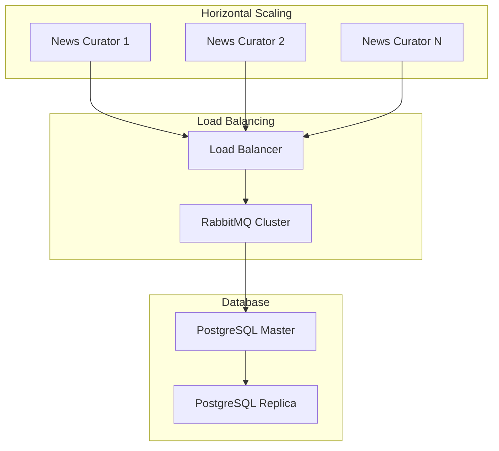

---

**Este fluxograma documenta completamente o sistema de curadoria de notícias, desde a inicialização até o processamento final, incluindo todos os aspectos de mensageria, tratamento de erros e monitoramento.**